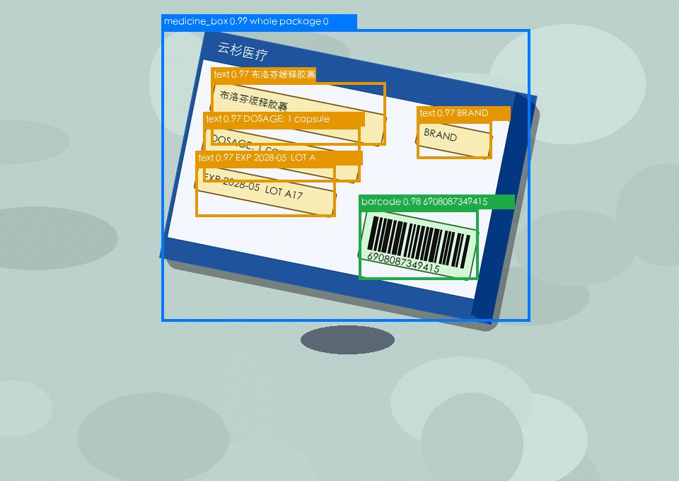

# Medicine Box AI Final Demo

本仓库当前目标：先跑通电脑端药盒检测 demo。Grove Vision AI V2 相关串口、刷写、AT 调用代码保留，但默认不依赖 Grove 实机。

## 当前可运行内容

- 电脑端独立 demo：生成多样化合成药盒图，训练轻量 detector，推理检测 `medicine_box`、`barcode`、`text`，输出 JSON、评估指标、YOLO 数据集和带框图片。
- 合成变化：旋转、多盒、遮挡、多背景、不同药盒配色、中文/英文/商标等小字。
- 单图 fallback：`--image path.jpg` 可以对已有图片跑同一 detector。
- 真实图片 pipeline：面向手持、倾斜、镜像/倒置、反光、无条码药盒照片。
- 机器学习路线：生成数据校准 fallback profile；可选 YOLOv8n 训练；真实数据可继续 fine-tune。
- Grove 辅助脚本：保留 `scripts/grovevision_at.py`、`scripts/deploy_we2_model.py`、`scripts/run_hybrid_demo.py`，但不是默认验收路径。
- 文档和报告：`reports/` 内保留架构、训练总结、数据计划和演讲稿。

## 快速开始

```bash
python3 -m venv .venv
source .venv/bin/activate
python3 -m pip install -r requirements.txt

python3 scripts/run_host_synthetic_demo.py --force-train
```

成功时终端会看到类似：

```text
PASS demo_000.jpg: medicine_box=1 barcode=1 text=3
PASS demo_001.jpg: medicine_box=1 barcode=1 text=3
```

默认输出：

```text
out/host_synthetic_demo/
  synthetic_detector_profile.json
  yolo_dataset/data.yaml
  test_fixed/manifest.json
  demo/images/*.jpg
  results/*.json
  results/*_overlay.jpg
  results/metrics.json
  results/summary.json
```

## 电脑端 Demo 做了什么

`scripts/run_host_synthetic_demo.py` 从零执行完整 host-side 流程：

1. 生成合成药盒训练/验证/固定测试/demo 图和标签。
2. 从生成标签校准轻量颜色/几何 detector。
3. 导出标准 YOLO 数据集。
4. 在固定测试集记录 `mAP50_proxy`、F1、漏检率和延迟。
5. 推理检测整盒药盒、条码区域和文字区域。
6. 写入结构化 JSON。
7. 生成带框 overlay 图片。

Overlay 示例：



示例检测 JSON 包含：

```json
{
  "counts": {
    "medicine_box": 1,
    "barcode": 1,
    "text": 3
  },
  "detections": [
    {
      "label": "medicine_box",
      "score": 0.99,
      "bbox_xyxy": [228, 41, 749, 454],
      "bbox_xywh": [228, 41, 521, 413],
      "text_hint": "whole package 0"
    },
    {
      "label": "barcode",
      "score": 0.98,
      "bbox_xyxy": [507, 296, 676, 395],
      "bbox_xywh": [507, 296, 169, 99],
      "text_hint": "6908087349415"
    }
  ]
}
```

说明：当前脚本中的 barcode 数字和 text 内容来自合成图生成标签，用于 demo 验证，不等同真实 OCR 或真实条码解码。

## 真实图片 Pipeline

```bash
python3 scripts/run_real_image_pipeline.py \
  --image /path/to/image.jpg \
  --output out/real_image_check
```

兼容旧入口：

```bash
python3 scripts/run_host_synthetic_demo.py \
  --image /path/to/image.jpg \
  --output out/real_image_check
```

输出：

```text
out/real_image_check/results/<image>.json
out/real_image_check/results/<image>_corrected.jpg
out/real_image_check/results/<image>_overlay.jpg
```

真实图片 JSON 示例：

```json
{
  "orientation": "mirrored",
  "barcode_status": "not_visible",
  "counts": {
    "medicine_box": 1,
    "barcode": 0,
    "text": 5
  },
  "detections": [
    {
      "label": "medicine_box",
      "score": 0.93,
      "bbox_xyxy": [120, 140, 1510, 780],
      "bbox_xywh": [120, 140, 1390, 640],
      "text_hint": "real image medicine box candidate"
    },
    {
      "label": "text",
      "score": 0.72,
      "bbox_xyxy": [250, 210, 980, 310],
      "bbox_xywh": [250, 210, 730, 100],
      "text_hint": "text_region_1"
    }
  ]
}
```

真实 pipeline 会尝试 `normal`、`rotated_180`、`mirrored`、`mirrored_rotated` 四种方向，选择得分最高方向并输出校正图。若图中无条码，`barcode` 可以是 `0`，并写入 `barcode_status: "not_visible"`。

## 评估与 YOLO 数据

默认 demo 会生成固定测试集并输出：

```text
out/host_synthetic_demo/results/metrics.json
out/host_synthetic_demo/yolo_dataset/data.yaml
```

也可以单独评估：

```bash
python3 scripts/evaluate_host_synthetic_detector.py \
  --manifest out/host_synthetic_demo/test_fixed/manifest.json \
  --model out/host_synthetic_demo/synthetic_detector_profile.json \
  --output out/host_synthetic_demo/results/eval_metrics.json
```

训练/准备电脑端检测资产：

```bash
python3 scripts/train_host_detector.py \
  --output out/models \
  --dataset-output out/host_training
```

这会生成：

```text
out/models/host_detector_profile.json
out/models/host_detector_metrics.json
out/models/host_detector_training_report.json
out/host_training/yolo_dataset/data.yaml
```

## 导入旧 LabelImg 真实标注

已从旧项目导入：

```text
/Users/dep/Projects/New_project/captures/host_session_001
```

导入后路径：

```text
data/real_labelimg_yolo/data.yaml
data/real_labelimg_yolo/manifest.json
```

类别映射：

```text
旧 0 barcode -> 新 1 barcode
旧 1 text    -> 新 2 text
```

当前导入统计：

```text
train: 76 images, 228 text boxes
val:   20 images, 60 text boxes
```

注意：这批 LabelImg 标注实际只有 `text` 框，没有 `medicine_box` 整盒框，也没有 barcode 框。它已经被训练脚本自动识别，并写入 `out/models/host_detector_training_report.json`。可单独用于 YOLO 文本区域微调：

```bash
yolo detect train \
  model=out/yolo_runs/medicine_box_synth/weights/best.pt \
  data=data/real_labelimg_yolo/data.yaml \
  imgsz=640 \
  epochs=20 \
  project=out/yolo_runs \
  name=real_labelimg_text_finetune
```

更真实的固定测试集评估：

```bash
python3 scripts/evaluate_realistic_synthetic.py \
  --model out/models/host_detector_profile.json \
  --output out/realistic_synthetic_eval
```

YOLOv8n 训练路线（可选，需要自行安装 `ultralytics`）：

```bash
pip install ultralytics
python3 scripts/train_host_detector.py --try-yolo --epochs 30
```

真实微调路线：

1. 用同一类别表标注真实图片：`0 medicine_box`, `1 barcode`, `2 text`。
2. 保持 YOLO 目录结构：`images/train`, `images/val`, `labels/train`, `labels/val`。
3. 先用合成数据预训练，再用真实数据继续训练：

```bash
yolo detect train \
  model=out/yolo_runs/medicine_box_synth/weights/best.pt \
  data=/path/to/real_medicine_box_yolo/data.yaml \
  imgsz=640 \
  epochs=20 \
  project=out/yolo_runs \
  name=medicine_box_real_finetune
```

## Grove 端状态

Grove 端代码暂不作为默认运行要求：

```bash
python3 scripts/grovevision_at.py --port /dev/cu.usbmodem5B420573151 probe
python3 scripts/grovevision_at.py --port /dev/cu.usbmodem5B420573151 invoke --image --min-score 50 --out out/grove_check
```

刷写脚本帮助页不再强制要求 `pyserial`：

```bash
python3 scripts/deploy_we2_model.py --help
```

真正刷写模型时仍需要 `pyserial` 和 Grove 实机。

## 主要目录

```text
scripts/
  run_host_synthetic_demo.py  # 默认电脑端合成 demo
  run_real_image_pipeline.py   # 真实手持图片 pipeline
  train_host_detector.py       # 生成数据 + 保存 fallback profile + 可选 YOLOv8n
  import_labelimg_dataset.py   # 导入旧 LabelImg YOLO 标注
  evaluate_realistic_synthetic.py
  run_hybrid_demo.py          # Grove 触发 + 主机 pipeline 串联脚本
  grovevision_at.py           # Grove AT 命令 helper
  deploy_we2_model.py         # Grove WE2 模型刷写 helper

local_train/
  generate_medicine_box_data.py
  medicine_box/data.yaml

reports/
  final_architecture.md
  local_training_summary.md
  dataset_needed.md
```

## 验证命令

```bash
python3 -m compileall -q scripts
python3 -m unittest discover -s tests -v
python3 scripts/deploy_we2_model.py --help
python3 scripts/import_labelimg_dataset.py --clean --output data/real_labelimg_yolo
python3 scripts/train_host_detector.py --train-count 12 --val-count 4 --test-count 4
python3 scripts/run_host_synthetic_demo.py --force-train --demo-count 2
python3 scripts/evaluate_host_synthetic_detector.py
python3 scripts/evaluate_realistic_synthetic.py --test-count 4
```

## 已知限制

- 默认 demo 针对生成图，保证可复现，不代表真实药盒照片泛化能力。
- 真实图片 pipeline 是 deterministic detector + 可选 OCR scoring + 训练 profile；没有真实标注集前，不能保证所有药盒都精准。
- 当前不要求 Grove 硬件接入，不验证串口 probe/invoke/flash。
- 合成 demo 的 text/barcode 字符串来自生成标签，不是真实 OCR/条码解码结果。
- 真实世界版本仍需采集真实药盒图、标注 whole-box/barcode/text，并训练更强 detector。
